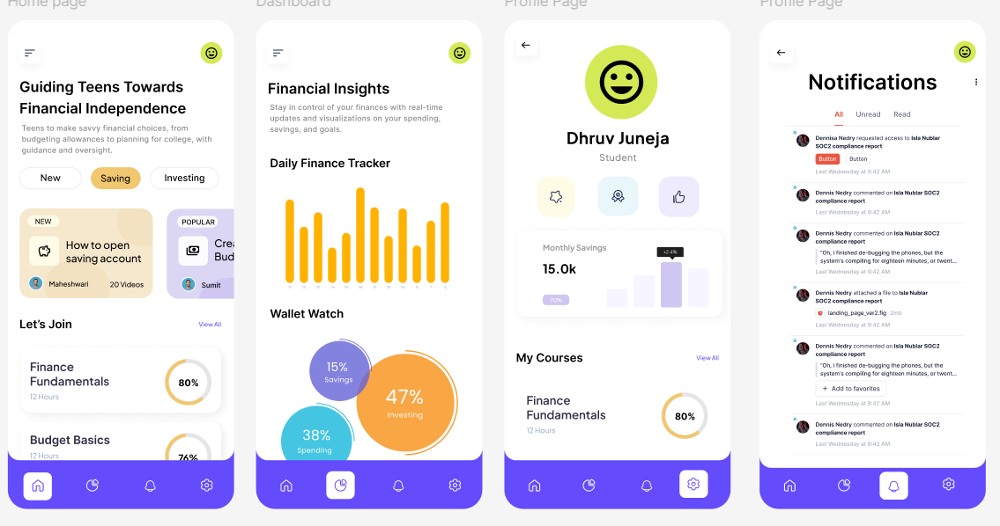
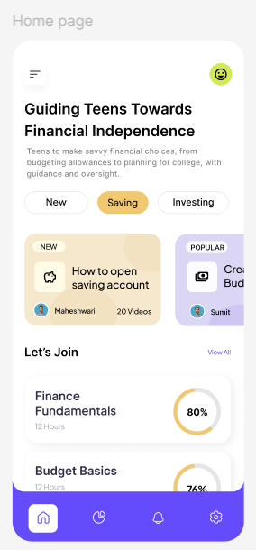
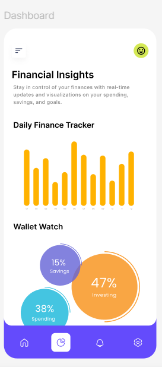
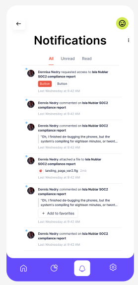
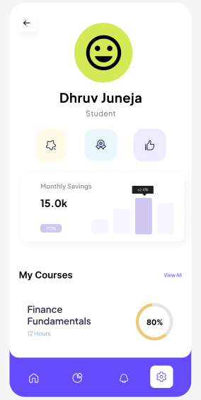

# Financial Literacy App - Figma Design  

The live Figma design for this project can be accessed here:  
[**View on Figma**](https://www.figma.com/design/mymH9ReiwFzTP21jrQBPJF/resume-dhruv?node-id=0-1&t=v5SJQcFalXheOJNm-1)  

Welcome to the **Financial Literacy App** repository! This app is designed to help teens achieve financial independence through intuitive designs and thoughtful features.  

---

## Full Design  

  

---

## Home Page  

  

The **Home Page** introduces users to the app's key functionalities:  
- **Guides and Courses:** Learn how to budget, save, and invest with step-by-step guides.  
- **Quick Access:** Easy navigation to financial tips and popular modules.  
- **Progress Tracking:** Monitor learning progress with visually engaging indicators.  

---

## Dashboard  

  

The **Dashboard** is where users can:  
- **Track Daily Finances:** View spending, savings, and investments with real-time insights.  
- **Wallet Insights:** Pie charts and graphs visualize financial habits for informed decision-making.  

---

## Notifications  

  

The **Notifications Page** ensures users stay informed:  
- Receive updates on new activities, comments, or alerts.  
- Interact with actionable items like reminders and reports.  

---

## Settings  

  

The **Settings Page** allows users to:  
- Manage their profiles and preferences.  
- Personalize the app's behavior for an optimized experience.  

